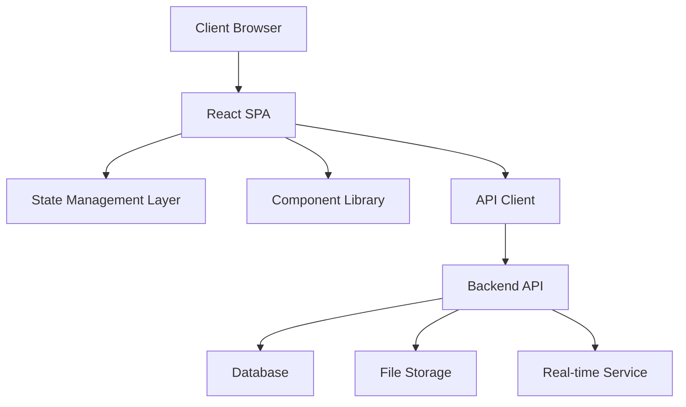

# Design Document

## Overview

StudioBoard is a React-based single-page application (SPA) that provides a premium project management experience for creative professionals and agencies. The application follows a component-driven architecture with a focus on performance, accessibility, and visual polish. The design emphasizes calm aesthetics through careful use of whitespace, typography, and subtle animations while maintaining professional functionality.

The application will be built using modern web technologies including React 18+, TypeScript, and CSS-in-JS for styling. The architecture supports real-time collaboration, responsive design, and modular component structure for maintainability and scalability.

## Architecture

### High-Level Architecture



### Frontend Architecture

The application follows a layered architecture pattern:

1. **Presentation Layer**: React components with styled-components for CSS-in-JS
2. **State Management**: Context API with useReducer for complex state, React Query for server state
3. **Business Logic**: Custom hooks for reusable logic and API interactions
4. **Data Layer**: API client with TypeScript interfaces for type safety

### Technology Stack

- **Frontend Framework**: React 18+ with TypeScript
- **Styling**: Styled-components with design tokens
- **State Management**: React Context + useReducer, React Query for server state
- **Routing**: React Router v6
- **Animation**: Framer Motion for micro-interactions
- **Icons**: Lucide React (Feather-style icons)
- **Drag & Drop**: @dnd-kit/core for accessible drag-and-drop
- **Date Handling**: date-fns for calendar functionality
- **Build Tool**: Vite for fast development and optimized builds

## Components and Interfaces

### Core Layout Components

#### AppShell
```typescript
interface AppShellProps {
  children: React.ReactNode;
  sidebar?: React.ReactNode;
  header?: React.ReactNode;
}
```
- Fixed top navigation
- Expandable left sidebar
- Main content area with proper spacing
- Responsive breakpoints for mobile/tablet

#### Navigation
```typescript
interface NavigationItem {
  id: string;
  label: string;
  icon: LucideIcon;
  path: string;
  badge?: number;
}

interface NavigationProps {
  items: NavigationItem[];
  currentPath: string;
  isExpanded: boolean;
  onToggle: () => void;
}
```

### Dashboard Components

#### DashboardGrid
```typescript
interface DashboardGridProps {
  leftPanel: React.ReactNode;
  rightPanel: React.ReactNode;
  activityFeed: React.ReactNode;
}
```
- CSS Grid layout for responsive panels
- Configurable panel sizes
- Smooth transitions between layouts

#### ActivityFeed
```typescript
interface ActivityItem {
  id: string;
  type: 'comment' | 'task_update' | 'file_upload' | 'project_update';
  user: User;
  timestamp: Date;
  content: string;
  metadata?: Record<string, any>;
}

interface ActivityFeedProps {
  items: ActivityItem[];
  onLoadMore: () => void;
  isLoading: boolean;
}
```

### Project Management Components

#### ProjectCard
```typescript
interface Project {
  id: string;
  name: string;
  description: string;
  status: 'active' | 'on_hold' | 'completed' | 'archived';
  progress: number;
  dueDate: Date;
  team: User[];
  tags: string[];
  color: string;
}

interface ProjectCardProps {
  project: Project;
  variant: 'grid' | 'list';
  onSelect: (project: Project) => void;
}
```

#### TaskBoard (Kanban)
```typescript
interface Task {
  id: string;
  title: string;
  description: string;
  status: string;
  priority: 'low' | 'medium' | 'high' | 'urgent';
  assignee?: User;
  dueDate?: Date;
  tags: string[];
  attachments: File[];
}

interface Column {
  id: string;
  title: string;
  tasks: Task[];
  color: string;
  limit?: number;
}

interface TaskBoardProps {
  columns: Column[];
  onTaskMove: (taskId: string, fromColumn: string, toColumn: string) => void;
  onTaskUpdate: (task: Task) => void;
}
```

### File Management Components

#### FileGrid
```typescript
interface FileItem {
  id: string;
  name: string;
  type: 'file' | 'folder';
  size?: number;
  mimeType?: string;
  thumbnail?: string;
  lastModified: Date;
  version?: number;
}

interface FileGridProps {
  items: FileItem[];
  onUpload: (files: FileList) => void;
  onSelect: (item: FileItem) => void;
  onDelete: (item: FileItem) => void;
}
```

### Calendar Components

#### CalendarView
```typescript
interface CalendarEvent {
  id: string;
  title: string;
  start: Date;
  end: Date;
  type: 'deadline' | 'meeting' | 'milestone';
  project?: Project;
  color: string;
}

interface CalendarViewProps {
  events: CalendarEvent[];
  view: 'month' | 'week';
  onViewChange: (view: 'month' | 'week') => void;
  onEventSelect: (event: CalendarEvent) => void;
}
```

## Data Models

### Core Entities

#### User
```typescript
interface User {
  id: string;
  email: string;
  firstName: string;
  lastName: string;
  avatar?: string;
  role: 'admin' | 'manager' | 'member' | 'client';
  permissions: Permission[];
  preferences: UserPreferences;
  createdAt: Date;
  updatedAt: Date;
}

interface UserPreferences {
  theme: 'light' | 'dark';
  notifications: NotificationSettings;
  timezone: string;
  language: string;
}
```

#### Project
```typescript
interface Project {
  id: string;
  name: string;
  description: string;
  status: ProjectStatus;
  priority: Priority;
  startDate: Date;
  dueDate?: Date;
  completedAt?: Date;
  progress: number;
  budget?: number;
  client?: Client;
  team: ProjectMember[];
  tags: string[];
  color: string;
  settings: ProjectSettings;
  createdAt: Date;
  updatedAt: Date;
}

interface ProjectMember {
  userId: string;
  role: 'lead' | 'member' | 'viewer';
  joinedAt: Date;
}
```

#### Task
```typescript
interface Task {
  id: string;
  projectId: string;
  title: string;
  description: string;
  status: string;
  priority: Priority;
  assigneeId?: string;
  reporterId: string;
  dueDate?: Date;
  estimatedHours?: number;
  actualHours?: number;
  tags: string[];
  dependencies: string[];
  attachments: Attachment[];
  comments: Comment[];
  createdAt: Date;
  updatedAt: Date;
}
```

### Supporting Types

```typescript
type ProjectStatus = 'planning' | 'active' | 'on_hold' | 'completed' | 'cancelled';
type Priority = 'low' | 'medium' | 'high' | 'urgent';

interface Client {
  id: string;
  name: string;
  email: string;
  company: string;
  avatar?: string;
}

interface Attachment {
  id: string;
  filename: string;
  url: string;
  size: number;
  mimeType: string;
  uploadedBy: string;
  uploadedAt: Date;
}

interface Comment {
  id: string;
  content: string;
  authorId: string;
  createdAt: Date;
  updatedAt?: Date;
  mentions: string[];
}
```

## Error Handling

### Error Boundary Strategy

1. **Global Error Boundary**: Catches unhandled errors and displays elegant fallback UI
2. **Feature-Level Boundaries**: Isolate errors to specific features (e.g., task board, file manager)
3. **Component-Level Boundaries**: Protect critical components from cascading failures

### Error Types and Handling

```typescript
interface AppError {
  code: string;
  message: string;
  details?: Record<string, any>;
  timestamp: Date;
  userId?: string;
}

// Network errors
class NetworkError extends Error {
  constructor(message: string, public status: number) {
    super(message);
    this.name = 'NetworkError';
  }
}

// Validation errors
class ValidationError extends Error {
  constructor(message: string, public field: string) {
    super(message);
    this.name = 'ValidationError';
  }
}
```

### User-Friendly Error Messages

- Network issues: "Connection lost. Trying to reconnect..."
- Validation errors: Inline field-specific messages
- Permission errors: "You don't have permission to perform this action"
- File upload errors: "File too large. Please choose a file under 10MB"

## Testing Strategy

### Testing Pyramid

1. **Unit Tests (70%)**
   - Component logic and rendering
   - Custom hooks
   - Utility functions
   - Data transformations

2. **Integration Tests (20%)**
   - Component interactions
   - API integration
   - State management flows
   - User workflows

3. **End-to-End Tests (10%)**
   - Critical user journeys
   - Cross-browser compatibility
   - Performance benchmarks

### Testing Tools

- **Unit/Integration**: Jest + React Testing Library
- **E2E**: Playwright
- **Visual Regression**: Chromatic (Storybook)
- **Performance**: Lighthouse CI

### Key Test Scenarios

1. **Dashboard Loading**: Verify all panels load correctly with proper data
2. **Project Creation**: Complete project setup workflow
3. **Task Management**: Drag-and-drop functionality, status updates
4. **File Upload**: Drag-and-drop file upload with progress indication
5. **Real-time Updates**: Chat messages and activity feed updates
6. **Client View**: Restricted access and proper data filtering
7. **Responsive Design**: Mobile and tablet layouts
8. **Accessibility**: Keyboard navigation and screen reader support

### Performance Testing

- **Core Web Vitals**: LCP < 2.5s, FID < 100ms, CLS < 0.1
- **Bundle Size**: Main bundle < 250KB gzipped
- **Memory Usage**: No memory leaks during extended use
- **Animation Performance**: 60fps for all transitions

## Design System Implementation

### Design Tokens

```typescript
export const tokens = {
  colors: {
    background: {
      primary: '#FAF9F7',
      secondary: '#F5F4F2',
      elevated: '#FFFFFF',
    },
    text: {
      primary: '#1A1A1A',
      secondary: '#6B6B6B',
      muted: '#9B9B9B',
    },
    accent: {
      primary: '#D2691E', // Burnt orange
      secondary: '#5F9EA0', // Muted teal
    },
    status: {
      success: '#10B981',
      warning: '#F59E0B',
      error: '#EF4444',
      info: '#3B82F6',
    }
  },
  typography: {
    fonts: {
      primary: 'Inter, -apple-system, BlinkMacSystemFont, sans-serif',
      heading: 'General Sans, Inter, sans-serif',
    },
    sizes: {
      xs: '0.75rem',
      sm: '0.875rem',
      base: '1rem',
      lg: '1.125rem',
      xl: '1.25rem',
      '2xl': '1.5rem',
      '3xl': '1.875rem',
      '4xl': '2rem',
    }
  },
  spacing: {
    xs: '0.25rem',
    sm: '0.5rem',
    md: '1rem',
    lg: '1.5rem',
    xl: '2rem',
    '2xl': '3rem',
    '3xl': '4rem',
  },
  borderRadius: {
    sm: '0.25rem',
    md: '0.5rem',
    lg: '0.75rem',
    xl: '1rem',
    '2xl': '1.5rem',
  }
};
```

### Animation Guidelines

- **Duration**: 150ms for micro-interactions, 300ms for transitions, 500ms for complex animations
- **Easing**: `cubic-bezier(0.4, 0, 0.2, 1)` for most transitions
- **Hover States**: 150ms transition for all interactive elements
- **Loading States**: Skeleton screens with subtle pulse animation
- **Page Transitions**: 300ms fade with slight vertical movement